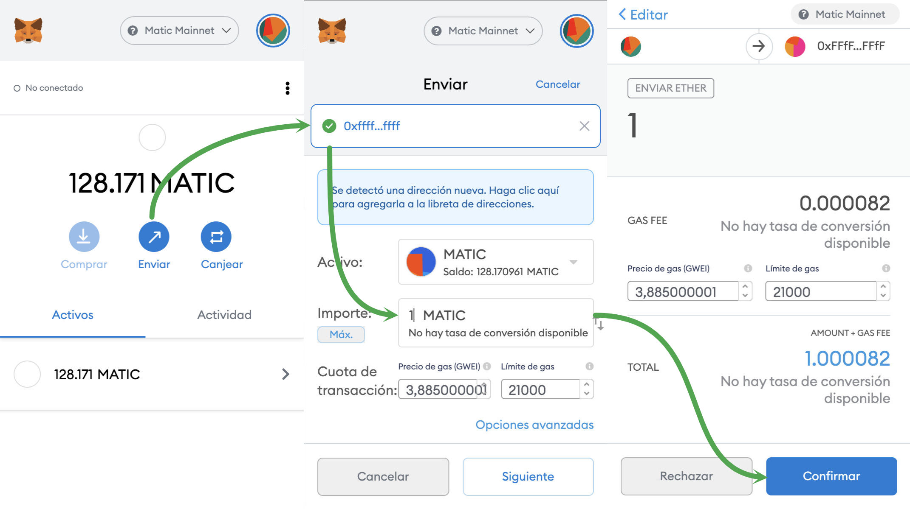

# L2 Airdrop

This repository is a collection of command line tools to do massive Airdrops of Decentraland Wearables on Matic

&nbsp;

## Index

- Installation
- Setup
- Airdrop

&nbsp;

&nbsp;

## Installation

```bash
  # Download code
  git clone git@github.com:decentraland/l2-airdrop.git

  # Install dependencies
  cd l2-airdrop && npm install
```

&nbsp;

&nbsp;

## Setup

Before you start to do airdrops you need to setup your environment,

### Create a new `.env` file

```bash
  cp .env.example .env
```

### Create a private key that would be use to mint your wearables

```bash
  openssl rand -hex 32
  # => 111...999
```

### Save your new private key in your `.env` file

```bash
  # .env
  CHAIN_ID=137
  ACCOUNT_PRIVATE_KEY=111...999
```

> You can use multiples private keys separated by `,` (ACCOUNT_PRIVATE_KEY=111...999,222...888)

Now you can see your new address using the following command

```bash
  npm run environment
```

```bash
CHAIN_ID:  137
ACCOUNT_WALLETS:  [
  '0xffffffffffffffffffffffffffffffffffffffff'
]
```

### Send `MATIC` to your new address

&nbsp;



&nbsp;

&nbsp;

> `1 MATIC` is more than enough

### Add your new address as minter on your builder collection

Go to [`https://builder.decentraland.org/collections`](https://builder.decentraland.org/collections), open the collection you want yo airdrop and add your new address as a minter


&nbsp;

&nbsp;

## Airdrop

```bash
  npm run send -- --contract [COLLECTION_ADDRESS] -batch 100 -input address.csv -output transactions.output
```

```bash
Options:
      --help      Show help                                                  [boolean]
      --version   Show version number                                        [boolean]
  -i, --input     CSV file with the addresses to airdrop           [string] [required]
  -b, --batch     The amount of items minted by transactions   [number] [default: 100]
  -c, --contract  The collection address on polygon                [string] [required]
  -o, --output    The file to dump the output (default: stdout)               [string]
```

### Where do you get the `COLLECTION_ADDRESS`

Go to [`https://builder.decentraland.org/collections`](https://builder.decentraland.org/collections) open the collection you want to airdrop and copy its address


### Create your `addresses.csv` file

In order to mint a big amount of wearables you will need a `.csv` file with an address and item id per line

```csv
ADDRESS,ITEM_ID
ADDRESS,ITEM_ID
ADDRESS,ITEM_ID
```

In the following example the address `0xfff...fff` is going to receive items `0` and `1` and the address `0xeee...eee` is going to receive only the item `1`

```csv
0xffffffffffffffffffffffffffffffffffffffff,0
0xffffffffffffffffffffffffffffffffffffffff,1
0xeeeeeeeeeeeeeeeeeeeeeeeeeeeeeeeeeeeeeeee,1
```

### How to get the `ITEM_ID`

Got yo [polygonscan](https://polygonscan.com/) as search for your `COLLECTION_ADDRESS`


Open the `Contact` section and then the `Read contract` button


Using the method `26. items` you can check the info of each item id


